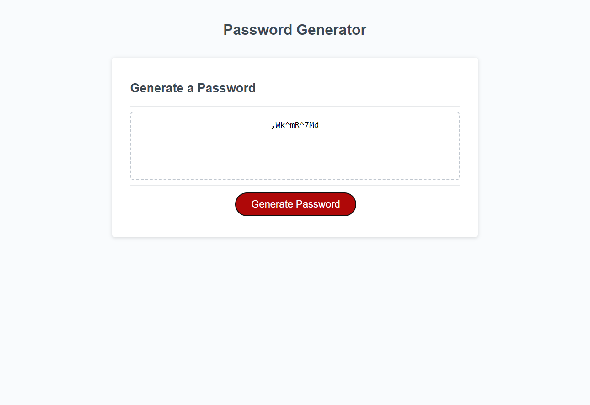

# password_generator

This is a random password generator using HTML, CSS and JavaScript. This repo is meant to give you multiple different password options inlcuding, character counter, uppercase, lowercase, numbers and symbols to give you the most random password possible.

Deployable Link: https://davidgreenhouse.github.io/password_generator/
